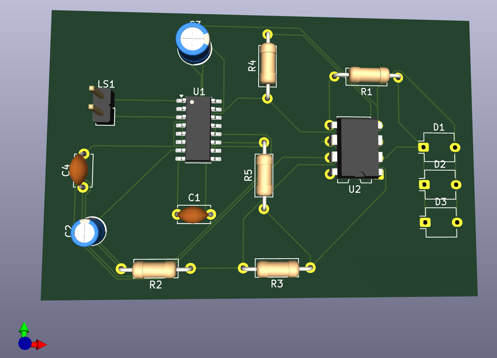

# Project Lux: A Free-Space-Optical Audio Link

[](https://opensource.org/licenses/MIT)

A self-aligning, laser-based audio communication system built for the Howard University **IEEE H.O.P.E. (Hands-On PCB Engineering)** Project (Fall 2025).



## 🎯 Project Overview

Project Lux is a free-space optical (FSO) communication system that transmits a high-fidelity audio signal over a laser beam.

This project demonstrates the core principles of optical communication. The system consists of two main components:
1.  **The Transmitter:** Modulates an audio signal from a source (like a phone or laptop) onto a laser beam.
2.  **The Receiver:** Intercepts the laser beam, converts the light back into an electrical signal, and amplifies it to drive a speaker.

This creates a simple, point-to-point wireless audio link.

### Key Features
* **Audio Modulation:** An analog circuit modulates a 3.5mm audio input signal onto a laser diode.
* **Optical Detection:** A photodiode array (`BPW34`) detects the modulated laser beam and converts it back into an electrical signal.
* **Custom PCB:** All transmitter and receiver electronics are designed on custom PCBs using KiCad.


## 📡 Receiver Board Design

The receiver board is the "ear" of the system, designed to convert the incoming light signal back into audible sound. The signal path is a three-stage amplification process.

### 1. Stage 1: TIA (Current-to-Voltage)
* **Detection:** An array of `BPW34` photodiodes captures the modulated laser light, generating a tiny electrical current proportional to the light's brightness.
* **Conversion:** The first op-amp (`LM358`) is configured as a **Transimpedance Amplifier (TIA)**. It converts this weak input *current* into a usable *voltage* signal.

### 2. Stage 2: Voltage Pre-Amplification
* **Gain:** The voltage from the TIA is fed into the second op-amp (`LM358`), which is configured as a **non-inverting amplifier**. This stage boosts the line-level signal to make it stronger and more robust against noise.

### 3. Stage 3: Power Amplification
* **Coupling:** A `1uF` capacitor (`C2`) blocks any DC offset before sending the clean AC audio signal to the final stage.
* **Power Amp:** A `PAM8403D` Class-D audio amplifier takes the line-level signal and provides the necessary power to drive a standard `LS1` speaker.

### Key Components
* **Photodiodes:** `BPW34` (x3)
* **Op-Amp (TIA & Pre-Amp):** `LM358`
* **Power Amplifier:** `PAM8403D`

## ⚙️ Tech Stack & Components

### Hardware
* **Microcontroller:** Arduino Nano
* **Audio:** 3.5mm Audio Jacks, PAM8403D Audio Amplifier
* **Actuation:** 2x SG90 Servo Motors
* **Sensors:** Quadrant Photodiode Array
* **Circuits:** Op-Amps (e.g., LM358) for modulation/demodulation

### Software & Design
* **Firmware:** C++ (Arduino)
* **PCB Design:** KiCad (or Cadence)
* **Version Control:** Git & GitHub

## 📂 Repository Structure

This repository is organized to keep our hardware designs, firmware code, and documentation separate and clean.
```
/
├── hardware/
│   ├── Receiver board/     # KiCad project files for the receiver
│   └── Transmitter board/  # KiCad project files for the transmitter
├── firmware/
│   └── ...                 # Arduino C++ source code (coming soon)
├── media/
│   └── pictures
|         └─...                 # Schematics, 3D renders, and demo videos
├── docs/
│   └── ...                 # Datasheets, presentations, etc.
├── .gitignore
└── README.md
```
## 📖 Project Status

This project is **currently in progress**.

* [x] Phase 1: Research & Reference (Cornell ECE 4760)
* [x] Phase 2: Initial Circuit Design & Component Sourcing
* [x] Phase 3: Receiver PCB Layout
* [x] Phase 4: Transmitter PCB Layout
* [ ] Phase 5: Firmware Development (Scanning & Tracking)
* [ ] Phase 6: Final Integration & Testing

## 👥 Team

* Abhishek Rana - Hardware Design (Receiver Board, Transmitter Board)
* Aayush Dahal - Hardware Design (Transmitter Board)
* Diego McCullough - Hardware Design (Power Board)

## 📜 Reference & Inspiration

This project is heavily inspired by the "Laser Audio Transmitter" final project from Cornell University's ECE 4760 course.
* **Link:** [https://people.ece.cornell.edu/land/courses/ece4760/FinalProjects/s2009/dyz2_jl589/dyz2_jl589/index.html](https://people.ece.cornell.edu/land/courses/ece4760/FinalProjects/s2009/dyz2_jl589/dyz2_jl589/index.html)

## 📄 License

This project is licensed under the **MIT License**. See the `LICENSE` file for full details.
